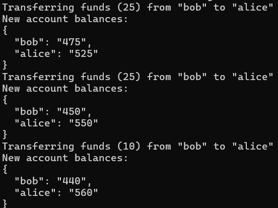

For this lab a normal computer is used with windows rather than a WM with Linux as the previous labs. This lab will explore the topic of cross site forgery.

A zip file with multiple examples is used to conduct this lab which will be cd into and the command 'npm install' to install the dev dependencies and 'npm start' to start the server.

Once the server starts open the website http://localhost:3000/ which is our target and login as bob with the password test. When the site is open we can see that our current balance is 500. Then we open http://localhost:3001/ which is the malicious site which prompts us to upgrade which then takes us back to the target site and shows us that our balance went down by 25. 

This all happened as we were a victim of a cross site forgery attack as Bob is authenticated on the target site but the malicious site forces bob's browser to make a get request to transfer money from his account to alices. The vulnerability comes as the server more than like does not verify the requests origin.

when looking in the provided server.js file in the folder we see the following:
app.get('/transfer', requireLogin, function(req, res, next) {
    transferFunds(
        req.query.to, 
        req.session.user.name,
        req.query.amount,
        //etc
    );
});

The vulnerability comes in the line with app.get which perfomrs a state-change without any protections.

Now we will conduct our own CSRF attack by editing the evil-examples.html file
we comment out the following code:
<a href="http://localhost:3000/transfer?to=alice&amount=25">Click here to upgrade!!!</a>

then we will enter our own malicious script within

which will now look like this

This code now automatically steals 10 from bob to alice.

we can see all the code working when looking at the figure below where the first two attacks steal 25 each and then we steal 10 with our own attack which occured automatically without a upgrade prompt

one countermeasures againts this is changing the SameSite cookie value from Lax to Strict which will not send the users cookies on request.