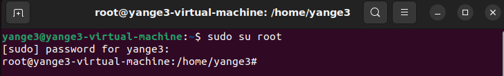

Starting with some basics, when changing from user to root using the commant 'sudo su root', the prompt changes from a format like this:
username@hostname:~$
to this:
root@hostname:/home/username#
like the example in this screeshot:
