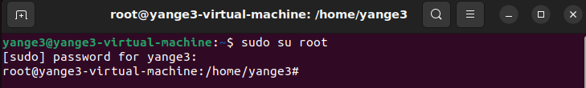
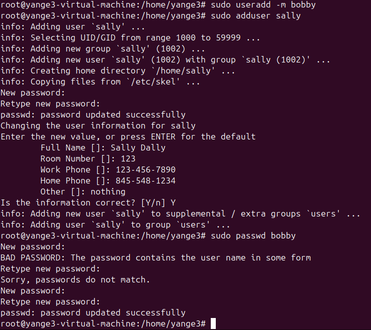

Starting with some basics, when changing from user to root using the commant 'sudo su root', the prompt changes from a format like this:
username@hostname:~$
to this:
root@hostname:/home/username#
like the example in this screeshot:

To add users in ubuntu, two commands can be used which are useradd and adduser. There are notable differences between the two that could change what one woud want to use. useradd does not automatically prompt the user to create a password for that user meaning that you would have to the run the command 'sudo passwd username' where adduser automatically guides the user through the password creation process. Also when messing with the passwords, it automatically detects if the password has the username in it and prevents you from creating that password.
Command line examples using the name bobby and sally:

if you want to change the current user to sally use the command 