Starting with some basics, when changing from user to root using the commant "sudo su root", the prompt changes from a format like this:
username@hostname:~$
to this:
root@hostname:/home/username#
like the example in this screeshot:

It is important to note that staying longed as the root could be potentially dangerous as it bypasses all permission checks leading to potential security risks and damages. Therefore, it is best practice to use sudo instead.

To add users in ubuntu, two commands can be used which are "useradd username" and "adduser username". There are notable differences between the two that could change what one woud want to use. 
useradd does not automatically prompt the user to create a password for that user meaning that you would have to the run the command 'sudo passwd username' where adduser automatically guides the user through the password creation process. 
Also when messing with the passwords, it automatically detects if the password has the username in it and prevents you from creating that password.
For the purpose of this lab, I have created the user Bobby using useradd and sally using adduser.
Command line example:

if you want to change the current user to sally use the command su - username, in this case, sally was chosen. sudo should be used instead of su if user has sudo privilieges. The prompt can now be seen as has been changed from root back to a user. The image can be seen below:
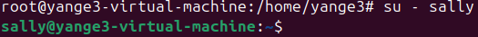

Since the user sally doesn't permissions, if she isnt able to add users and if she trys, she will get a erro message as seen in the this image:
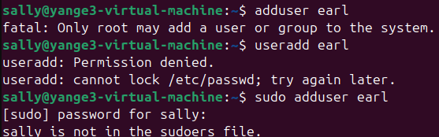

If a user needs to be deleted the command "sudo userdel username" is used or "sudo deluser username". The differences between userdel and deluser are similar to adduser and useradd with useradd being preferable as it actually prompts the user when the user is deleted.

If you ever need to change a password for a user in the event that you forget or some other reason, the command "sudo passwd user". Ensure you are someone with sudo permissions to do this.
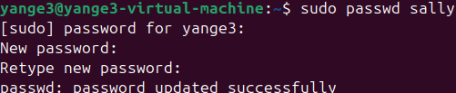

To check user id the simple command of "id -u" will give you the id of the user currently selected and if you need more information you can just use "id".
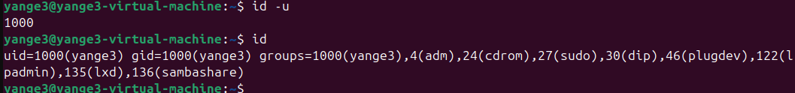

Moving away from individual users and onto groups, to view the users in a group, use the command "group username".

One important thing to note is that sudo is a group that gives people the ability to use sudo commands. If you want to add a user to a group the command "sudo usermod -aG sudo username" is to be used.
For example, sally was added to the sudo group and now has sudo permission which means that now she can create users and not get the errors like previously

TO create groups, two commands can be used like adding users with "groupadd" and "addgroup", with addgroup being preferable. For this lab a group called cybersec was created using the command "sudo addgroup cybersec". You can now add people to the group using a similar command used to add someone to the sudo group, for example if I want to add sally to cybersec I would use the command "sudo usermod -aG cybersec sally". To check who is in the group you can use either "sudo groupadd groupname" or "grep groupname /etc/group".
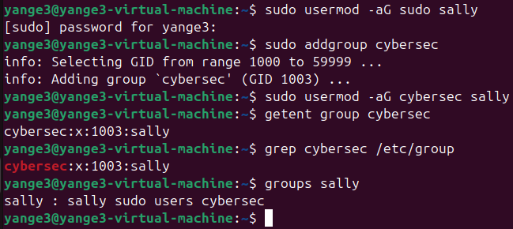

Now to create a directory, the command "mkdir directoryName" is used. if you need the directory to be somewhere specific you can use a '/' for example the command "mkdir /home/sally/lab1". To verify the directory has been created the command "ls -l" can be used which also list the permission, owner, and group owner of the directory.
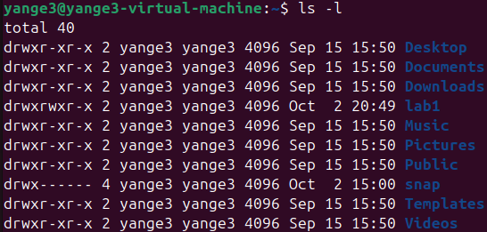

As seen in the image with the directory named "lab1", we can see that the permission as drwxr-xr-r. The drwxr section means that the owner has write, read, and execute permissions, xr means that the group only has execute and read permissions and r means that everyone else only has read permissions.

To change the selected directory the command "cd directoryName" is used. You can see that the directory is selected after a "~directoryName" appears next to the username like seen in the image below.
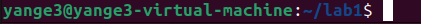

Now to create runable bash files like a simple one such as "hello world" use the command "nano helloworld.sh". This will bring us into a prompt where we can write echo "Hello World!" and be sure to add "#!/bin/bash" to the top to ensure the system runs the code properly.
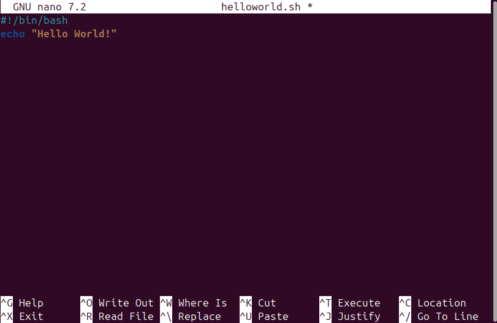

To save and exit the bash file hit CTRL+O, ENTER, then CTRL+X. Using the command "chmod +x helloWorld.sh" makes the file executable, you can use -x instead of +x to make it not executable. You can see the code run in the image below.
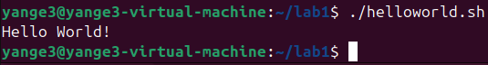

You can also now use the command "ls -la helloworld.sh" to see file permissions like for the helloworld, the permissions for the owner and group are rwxr which means both can write, read, and execute where for everyone else, it is only x which means they can only execute. You can also use the "getfacl helloworld.sh" command to get the the ACL of the file
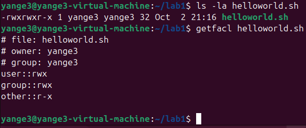

If we want someone else to have permissions in the file, for example if we want sally to be able to read and write to the file, the command "sudo setfacl -m u:sally:rw helloWorld.sh"
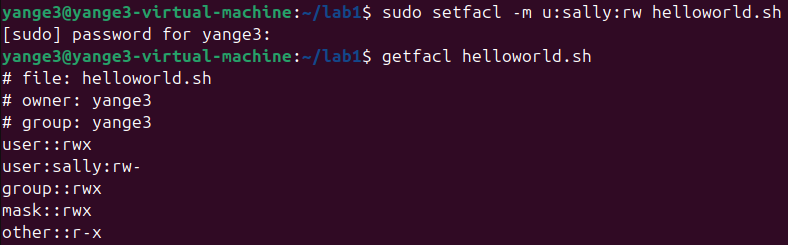

This concludes the basics of the linux command line and provides a strong basis for future labs.