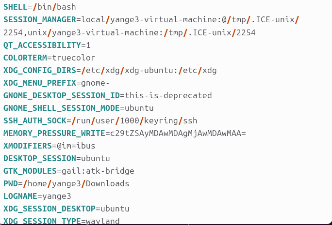

To continue developing our understanding of around cybersecurity, a seed lab is conducted following the outline seen here https://seedsecuritylabs.org/Labs_20.04/Files/Environment_Variable_and_SetUID/Environment_Variable_and_SetUID.pdf.
This seed lab will be centered around Environment Variables and Set UID.
The first task we will be performing will be manipulating Environment Variables (EVs). To print out and see the environment variables the command 'printenv' and 'env' though this prints ALL the environment variables. To get information on a specific EV the previous commands can be used again but now with extra words. For example, if you need more info of the EV 'PWD' the command 'printenv PWD' or 'env | grep PWD'.
If the EVs need to be changed or unchanged the command 'export' is used to set a EV and 'unset' to unset a EV. For example if you want a EV MY_NAME to be set as Sally, use the command 'export MY_NAME="Sally"' though this is only temporary until as it will unset when the terminal closes. To unset MY_NAME use the command 'unset MY_NAME'.

The next task around EVs will be about EVs from a parent process to a child process, more specifically if a EV is inherited from the parent to the child.
To do this task, the program 'myprintenv.c' from the provided zip folder will be used.
myprintenv.c:
#include <unistd.h>
#include <stdio.h>
#include <stdlib.h>

extern char **environ;
void printenv()
{
    int i = 0;
    while (environ[i] != NULL) {
        printf("%s\n", environ[i]);
        i++;
    }
}

void main()
{
    pid_t childPid;
    switch(childPid = fork()) {
        case 0: /* child process */
            printenv(); ➀
            exit(0);
        default: /* parent process */
            //printenv(); 
            exit(0);
    }
}

The program is first compiled using 'gcc myprintenv.c' and ensure that we are in the directory the file is located in. To see what happens the outpur can be saved into a file using 'a.out > file' and some of the files contents can be seen in the image below.

We can see that the result is that we get a complete set of environment variables.this shows that the child process inherited the EVs from the parent as the parent code is currently commented out.

The next step we will comment out the printenv line in the child code and uncomment that line in the parent code and save the output to a file called file2. To check the differences between file and file2, the command 'diff file file2' is used and since there is no output that means there are no differences which means the child inherited all the EVs from the parent.

The next task will be using the execve and seeing how it affects EVs. For this the program 'myenv.c' is used. 
myenv.c:
#include <unistd.h>

extern char **environ;
int main()
{
    char *argv[2];

    argv[0] = "/usr/bin/env";
    argv[1] = NULL;
    execve("/usr/bin/env", argv, NULL); ➀
    return 0 ;
}

The first step is to compile and run it but no output is shown. This shows that execve() does not inherit the parents process.

Foe the next task the line 'execve("/usr/bin/env", argv, NULL);' has the line changed to 'execve("/usr/bin/env", argv, environ);'. When this is done, the full list of envrionment variables is printed. Now that 'environ' is used instead of 'NULL' the child program now has the same environment as the parent.

The next task instead of using 'execve()' a system call is used.